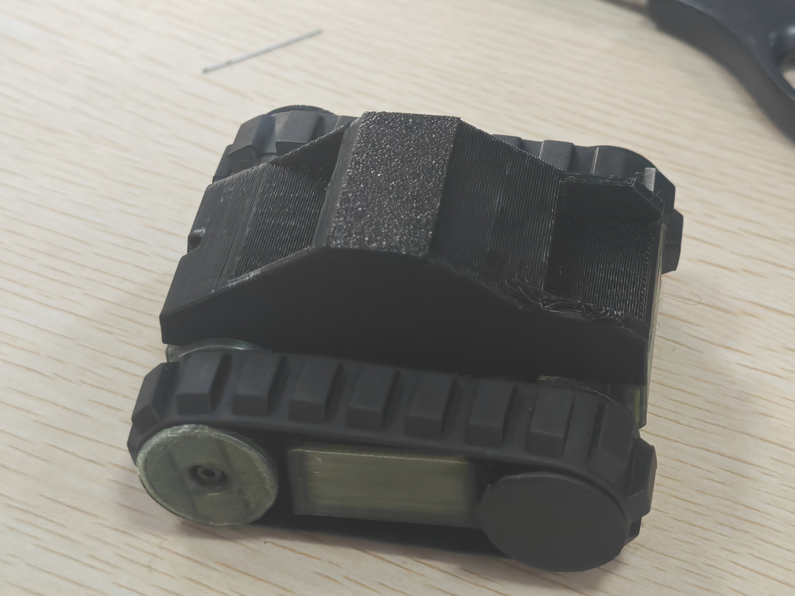
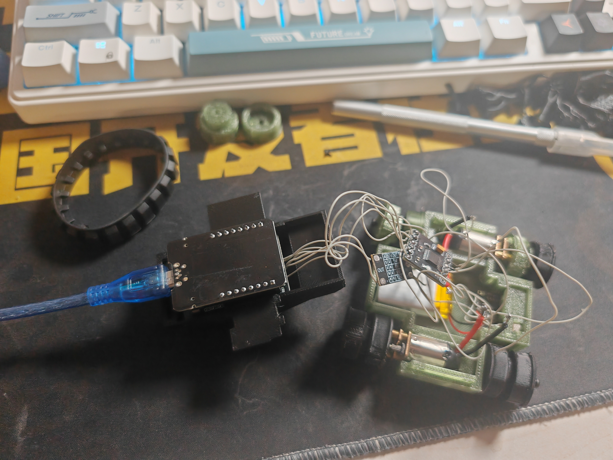
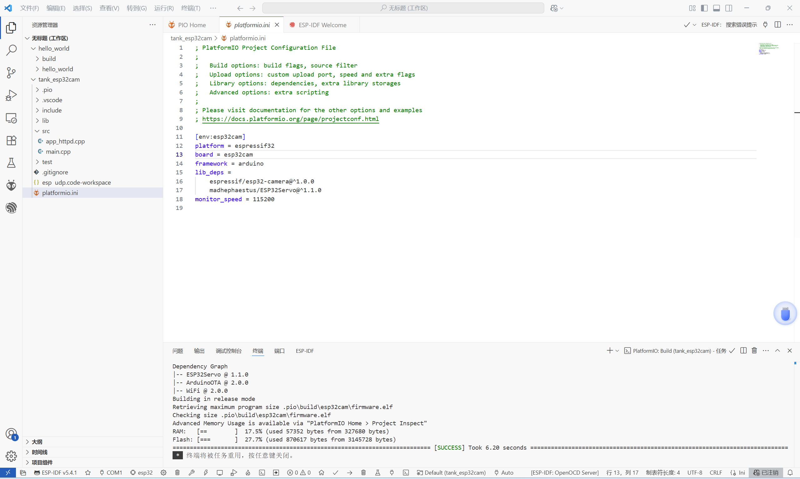

# 迷你履带式机器人项目展示

综合软硬件开发实践成果

---

**导航**

- [项目介绍](#项目介绍)
- [演示视频](#演示视频)
- [团队介绍](#团队介绍)
- [开发过程](#开发过程)
- [技术亮点](#技术亮点)
- [总结与展望](#总结与展望)

---

## 项目介绍

本项目设计并实现了一款**迷你履带式机器人车**，主要应用于狭窄、复杂或存在潜在危险的环境（如管道、废墟、灾后现场等），实现远程侦察、监测与数据采集，降低人员作业风险、提升现场处理效率。

系统以**ESP32-CAM 模块**为核心控制单元，搭载实时视频采集与无线图像回传功能，支持WiFi热点直连与浏览器访问，用户无需额外应用程序即可远程查看摄像头画面并控制小车运动。

硬件部分集成了**双履带驱动系统**（L293D电机驱动模块）、**舵机云台控制**（可调摄像头视角）、**LED照明系统**（低照度环境下辅助补光），软件通过Arduino C++开发完成，涵盖底层驱动控制、图像采集、WiFi网络通信、PWM调光、舵机控制、故障检测等模块，整体架构模块化、易扩展。

此外，系统预留**OTA在线升级**接口，方便后续通过WiFi远程推送固件更新，无需实体接触即可迭代升级功能。

### 成品展示

---

## 演示视频

以下为系统实机演示视频：

[Bilibili 演示视频链接](https://player.bilibili.com/player.html?bvid=BV1XX4y1X7XX)
（点击链接可在B站观看。）

---

## 团队介绍

团队成员分工协作，保障项目顺利落地与完整交付：

- 罗祥瑞 — 上位机界面开发、车辆组装与测试
- 郭学栋 — 下位机控制系统开发（ESP32编程）
- 刘逸鑫 — 系统集成测试、演示视频拍摄与文档整理
- 文焕 — 电路硬件组装、舵机与履带驱动调试
- 夏嘉轩 — 上位机视觉界面设计与车辆结构改良

---

## 开发过程

项目整体按照课程任务分阶段推进，依次完成：

- 硬件选型与基础电路搭建（ESP32-CAM、电机驱动、舵机控制、履带组装）

  

- 下位机控制程序开发（Arduino平台编程、电机控制、舵机控制、LED控制）

  
  

- 摄像头模块集成、视频流数据传输测试、WiFi AP模式配置
- 上位机控制页面设计与串口调试通信
- 系统集成调试、异常情况容错、整体优化
- 系统演示录制、文档整理

---

## 技术亮点

项目开发过程中融入了多种软硬件结合技术，技术亮点主要包括：

- **ESP32-CAM模块深度应用：** 低成本高集成度，实现无线视频实时回传
- **双路履带差速控制：** 支持精准运动控制与转向机制
- **舵机云台系统：** 实现摄像头视角远程调节，适配复杂场景拍摄
- **LED照明模块：** 提升暗光环境拍摄清晰度
- **Arduino OTA支持：** 无线固件更新能力，方便后期维护与功能扩展
- **模块化设计：** 为未来扩展AI视觉识别、环境传感器等功能预留接口

---

## 总结与展望

通过本项目，我们完整实践了嵌入式系统开发的完整流程，涵盖了硬件搭建、电路设计、嵌入式编程、无线通信、系统集成与软硬件调试等能力。在团队合作下，项目从最初设计到完整实物落地，充分锻炼了团队协作、问题解决与工程实现能力。

后续我们计划在以下方向持续优化与拓展：

- 视频流压缩优化与帧率提升
- 控制响应延迟进一步降低
- 引入路径规划与半自主导航算法
- 增加环境传感器（气体、温湿度、红外避障等）
- 集成图像AI识别与智能分析能力

未来目标是打造一款具备一定自主侦查能力的履带式机器人，能适应更复杂环境应用场景。

---

&copy; 2025 迷你履带式机器人项目团队.